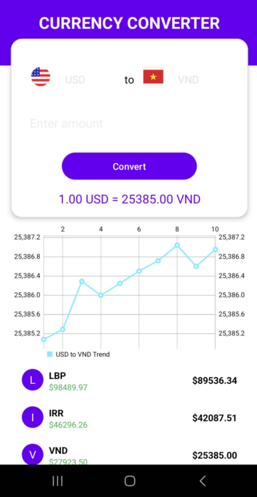

# Currency Converter

Currency Converter is a feature-rich mobile application designed for real-time currency conversion and visualization. The app provides:

- **Currency Conversion**: Supports conversions between various currencies like USD, EUR, VND, etc., using real-time exchange rates fetched from an API.
- **Dynamic Data Visualization**: Displays trends in exchange rates using interactive line charts.
- **Ranking Feature**: Provides a ranking of currencies based on their value relative to a base currency.
- **User-Friendly UI**: Incorporates spinners for selecting currencies, buttons for triggering conversions, and seamless animations for better user experience.

---

## Steps to Build and Run

### 1. Project Initialization
- Created a new project in Android Studio with the application name `CurrencyConverter` and package `com.example.currencyconverter`.

### 2. Gradle Configuration
- Configured `build.gradle` with the required dependencies for:
  - **Retrofit**: For API calls.
  - **MPAndroidChart**: For chart rendering.
  - **OkHttp**: For logging and network monitoring.

### 3. UI Development
- Designed the `activity_main.xml` layout with key components:
  - **Two Spinner elements** for selecting currencies.
  - **EditText** for inputting the amount.
  - **Button** for conversion functionality.
  - **LineChart** to visualize currency trends.
  - **ViewPager2** for dynamic ranking display.

### 4. Resource Integration
- Added flag icons for multiple currencies (e.g., `ic_usd_flag`, `ic_vnd_flag`, etc.) in the `res/drawable` folder.
- Configured XML drawables for custom backgrounds and inputs, such as `circle_flag_background.xml` and `rounded_background.xml`.

### 5. Logic Implementation
- Developed `MainActivity.kt` to:
  - Handle user interactions.
  - Fetch exchange rates via Retrofit using a REST API.
  - Update the chart dynamically with MPAndroidChart.
  - Implement the ranking display using ViewPager2 with paginated data.

### 6. Animations
- Added animations for UI elements using `ObjectAnimator` for a smooth and interactive user experience.

### 7. Launcher Icon Setup
- Designed and set up the app's launcher icon using Asset Studio, including both adaptive and legacy icons.

### 8. Testing
- Tested the app on a physical Android device connected via USB and on an emulator.
- Debugged UI responsiveness, API data rendering, and overall functionality.

### 9. Deployment
- Finalized the APK and installed it on a physical device for real-world testing.

---

## Challenges or Notes

1. **Dependency Setup**
   - Setting up dependencies for libraries like Retrofit, MPAndroidChart, and OkHttp was challenging due to compatibility issues and version mismatches. Adjusting the `build.gradle` file to meet the app's requirements and ensuring compatibility with the latest Android APIs took some effort.

2. **Free API Limitations**
   - The free API tier used for fetching exchange rates did not support some currency rates, which required upgrading to the BASIC plan to access the necessary features. This added complexity in ensuring accurate data for all supported currencies.

3. **Dynamic Chart Integration**
   - Implementing MPAndroidChart to dynamically display exchange rate trends while ensuring smooth animations and responsiveness posed challenges, especially when handling API responses and updating the chart data in real-time.

4. **Ranking Display**
   - Setting up `ViewPager2` for ranking and paginating data required careful handling of API responses and adapting the data to fit the design layout seamlessly.

5. **Testing on Physical Device**
   - Configuring the app to run on a physical device was tricky due to initial pairing issues with Android Studio over Wi-Fi. This was resolved by switching to a USB connection and ensuring proper debugging permissions.

---

## Demo Video

[Watch the Demo Video Here](https://drive.google.com/file/d/1APxm-SFAv49BjxtWVvuyctkuqCziVg8r/view?usp=drive_link)

